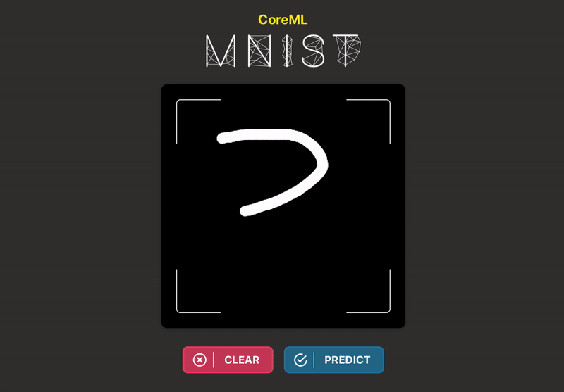
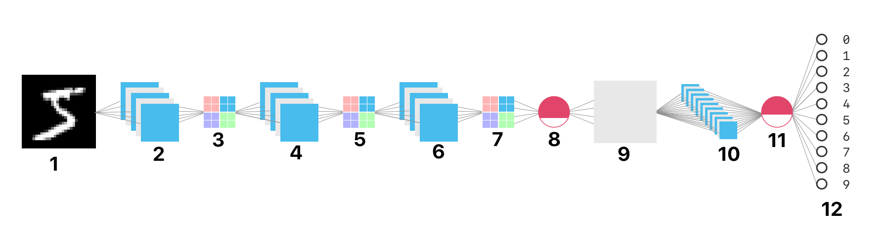

# MNIST + CoreML
Simple convolutional neural network to predict handwritten digits using Keras + CoreML built for WWDC '18 scholarship submission [**Accepted**]

## What is a Convolutional Neural Network ? 🤔

“A convolutional neural network is a class of deep, feed-forward artificial neural networks that have successfully been applied to analyzing visual imagery.

They were inspired by biological processes in that the connectivity pattern between neurons resembles the organization of the animal visual cortex. Individual cortical neurons respond to stimuli only in a restricted region of the visual field known as the receptive field. The receptive fields of different neurons partially overlap such that they cover the entire visual field.”

☝️ From [Wikipedia](https://en.wikipedia.org/wiki/Convolutional_neural_network)

---

☝️ Watch the full video on [YouTube](https://www.youtube.com/watch?v=3JQ3hYko51Y) by [Denis Dmitriev](https://www.youtube.com/channel/UC8m-a4A0jk2bkesfPdz1z_A)

---

## The MNIST Dataset ✍️

The [**MNIST database**](https://en.wikipedia.org/wiki/MNIST_database) is arguably the most famous database in the field of machine learning; it is a large database of **28**x**28** pixel images of handwritten digits created in 1999 by [Yann LeCun](http://yann.lecun.com/).

---

## The Model 💻

Our model consists of 12 layers:

1. Input (**28**x**28** pixel image)
2. Conv2D (Relu activation)
3. MaxPooling2D
4. Conv2D (Relu activation)
5. MaxPooling2D
6. Conv2D (Relu activation)
7. MaxPooling2D
8. Dropout (0.3)
9. Flatten
10. Dense
11. Dropout (0.4)
12. Dense (Softmax activation)

---

## Draw and classify digits in Playground Canvas 🎨

Run the [**MNIST+CoreML.playground**](https://github.com/omaralbeik/wwdc18/tree/master/MNIST%2BCoreML.playground) on Xcode 9.0+ or Swift Playground app on the iPad

---

## Creating and Training The Model 👩‍🏫

The model was created and trained using [Keras](https://keras.io/) (a high-level neural networks API, written in Python)

☝️ Run the [Jupyter notebook](https://github.com/omaralbeik/wwdc18/blob/master/Jupyter/mnist-covnet.ipynb) to train the network on your own device 💯

---

## Converting to CoreML 🧙‍

[Core ML](https://developer.apple.com/documentation/coreml) is a framework introduced by Apple at WWDC '17 to integrate machine learning models into iOS, tvOS, macOS and watchOS apps.

The [coremltools](https://github.com/apple/coremltools) python package makes it very easy to generate the *.mlmodel* file, then all you need to do is just drag and drop that file into your Xcode project and you're all set 😎

---

## Credits and Thanks 🙏

- The model was inspired by [mnist_cnn.py](https://github.com/keras-team/keras/blob/master/examples/mnist_cnn.py) by [Keras](https://github.com/keras-team/keras).
- [Udacity](https://www.udacity.com) for their awesome [Deep Learning Nanodegree](https://www.udacity.com/course/deep-learning-nanodegree--nd101) course.
- [Sasmito Adibowo](https://github.com/adib) for his [blog post](https://cutecoder.org/programming/core-ml-swift-playgrounds/) on how to add `.mlmodel` files to Swift Playground.

---

## Contributing
Your feedback is always appreciated and welcomed. If you find a bug in the source code, you can help me by submitting an issue. Even better you can submit a Pull Request with a fix :)

---

## License 👨‍⚖️

This project is released under the [MIT License](LICENSE)
